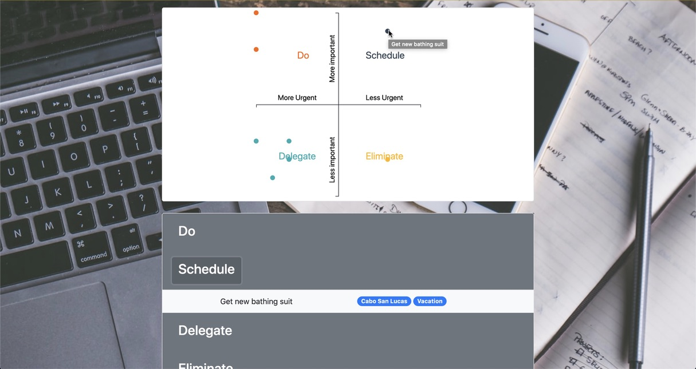
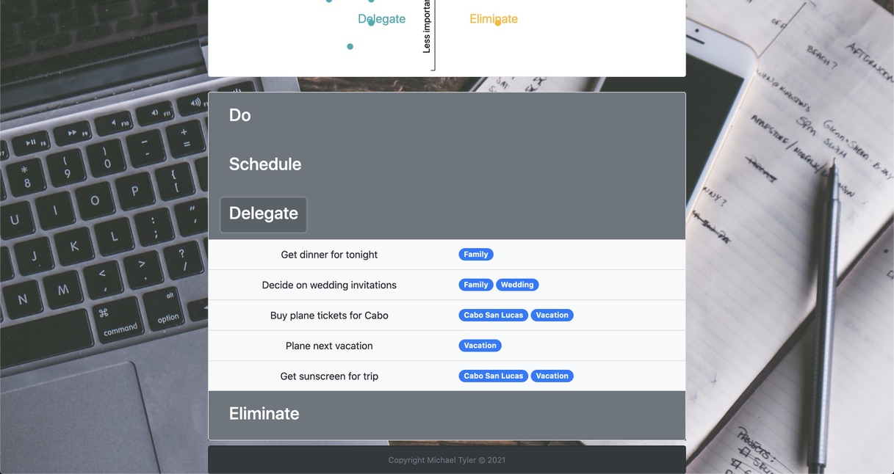
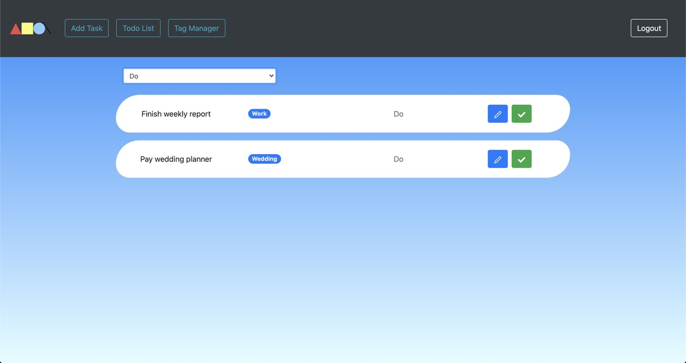
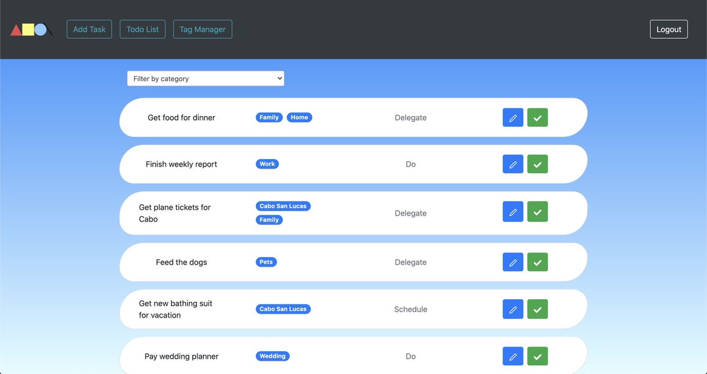
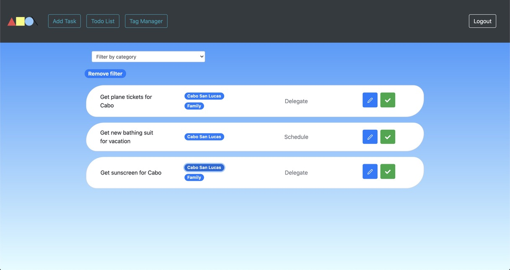
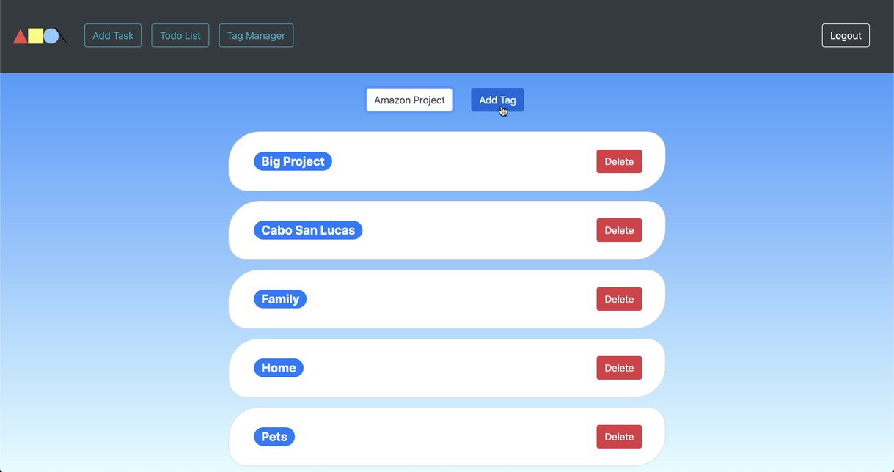

# [What to do](https://importantvsurgentmatrix.herokuapp.com)

## What's this all about?

### What To Do is a to-do list organizing app that, helps users intuitively manage and visualize their upcoming todos. If you like making to-do lists, this app brings a new approach to organizing that list. With a visual chart showing where these task rate, and customizable tags to really organize your lists. What To Do will have you knocking out these lists in no time.

## Features

* Add specific tags to help organize work, home, and event to-do list's
* Rate your tasks based off a system developed by President Dwight, D. Eisenhower
* Visualize your tasks plotted on an important vs. urgent matrix
* Manage your day by filtering by given categories or those custom tags

## Where can you sign up? 

[ Right Here!](https://importantvsurgentmatrix.herokuapp.com/)

# Screenshots

|  |
| :---: |
| See where your tasks chart |

|  |
| :---: |
|  |
| View your tasks by categories |

|  |
| :---: |
| Easy to read to-do list |

|  |
| :---: |
| Filter your list by clicking on the tags |

|  |
| :---: |
| Organization comes easy with these customizable tags |

## Technologies Used

This application was built with the [React](https://reactjs.org/) Javascript library and the server uses a SQLite database with Django REST frameworks. [You can view that repo by clicking here](https://github.com/Michaelr-Tyler/whattodo-server). Other packages used for producing this site include:

* [react-router-dom](https://reactrouter.com/) - Used to implement client-side routing
* [react-icons](https://react-icons.github.io/react-icons/) For adding icons when needed
* [react-bootstrap](https://react-bootstrap.github.io/) - Used for consistent styling
* [D3.js](https://d3js.org/) - Used to build a modified 4 quadrant graph that updates as new data is added

## Planning resources 

* [ERD](https://dbdiagram.io/d/5fbd4b183a78976d7b7d4324)
* [Wireframed with Miro Boards](https://miro.com/app/board/o9J_kgCz76U=/)

## Created by

Michael Tyler - [GitHub](https://github.com/michaelr-tyler), [LinkedIn](https://www.linkedin.com/in/michaelr-tyler/), [Personal Site](Michaelr-tyler.github.io)
